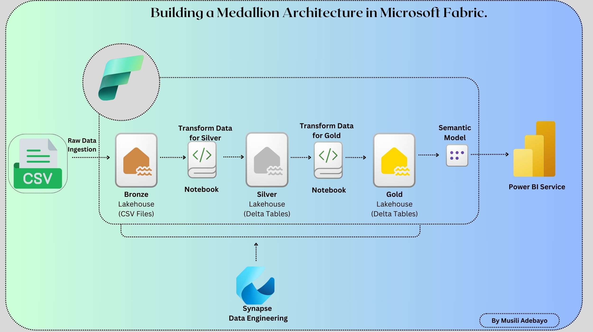
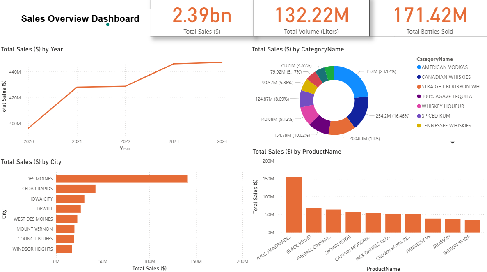

# Iowa Liquor Sales Analytics & Governance in Microsoft Fabric

## Project Overview
This project implements an end-to-end analytics solution on Microsoft Fabric using the Iowa Liquor Sales dataset. 
- The architecture follows the **Medallion Architecture** (Bronze -> Silver -> Gold)
- Apply **data transformations, cleansing, and star schema modeling**.
- Create an interactive **Power BI dashboard** for business insights.
- Implement **Fabric admin tasks** including **RBAC, sensitivity labels, workspace security, and governance**.

## Data Source

### Iowa Liquor Sales Dataset
This dataset is a subset of the Iowa Liquor Sales data, filtered for the period January 2020 – December 2025.
It contains spirits purchase information for Iowa Class “E” liquor licensees, organized by product and date of purchase.

The data can be used to analyze sales trends, store performance, and product demand in Iowa over the past five years.

- **Domain:** Sales & Distribution
- **Period Covered:** Jan 2020 – Present
- **Granularity:** Store-level and product-level transactions
- **License:** Class “E” licenses allow grocery stores, liquor stores, and convenience stores to sell liquor for off-premises consumption.
- **Origin:** Iowa Department of Revenue, Alcoholic Beverages Division

#### Use Cases:
- Trend analysis of liquor sales
- Store-level demand analytics
- Vendor/category performance analysis
- Geospatial analysis of liquor sales across counties

### Data Dictionary
| Column Name | Description | Data Type in Source |
| :--- | :--- | :--- |
| **Invoice/Item Number** | Unique identifier for individual liquor products in an order | Text |
| **Date** | Date of order | Floating Timestamp |
| **Store Number** | Unique number assigned to the store that ordered the liquor | Text |
| **Store Name** | Name of the store | Text |
| **Address** | Store address | Text |
| **City** | City of the store | Text |
| **Zip Code** | Store’s zip code | Text |
| **Store Location** | Geocoded coordinates (Address + City + State + Zip) | Point |
| **County Number** | Iowa county number of the store | Text |
| **County** | County name of the store | Text |
| **Category** | Category code of the liquor product | Text |
| **Category Name** | Category name of the liquor product | Text |
| **Vendor Number** | Vendor number of the liquor’s brand | Text |
| **Vendor Name** | Vendor name of the liquor’s brand | Text |
| **Item Number** | Unique number for the individual liquor product | Text |

## Architecture & Implementation

## ⚙️ Data Processing Steps

The project follows a **Medallion Architecture** for **data lakehouse processing**:

### 1. Load Data into Microsoft Fabric Lakehouse
- Raw CSV files uploaded into the **Lakehouse**.
- **Bronze layer** stores raw, unprocessed data.

### 2. Bronze Layer
- Sanitize column names (remove spaces/special characters).
- Load raw data without transformations.

### 3. Silver Layer (Transformations)
- Handle **null values**: replace with `"Unknown"` for strings, `0` for numeric columns.
- Remove **duplicate rows**.
- Convert **date column** to proper DateType.
- Ensure correct **data types** for numeric and text columns.

### 4. Gold Layer (Star Schema Modeling)
- **Dimension Tables:**
  - **dim_date:** DateKey, Year, Month, Quarter
  - **dim_store:** StoreKey, StoreName, Address, City, County, ZipCode
  - **dim_vendor:** VendorKey, VendorName
  - **dim_product:** ProductKey, ItemNumber, ItemDescription, CategoryName, Pack, BottleVolumeML
- **Fact Table:**
  - **fact_liquor_sales:** InvoiceKey, DateKey, StoreKey, VendorKey, ProductKey, BottlesSold, SaleDollars, VolumeLiters
- **Surrogate Keys** are generated for dimensions to optimize joins.
- **Joins** link fact table with dimensions for analytics queries.

---

## 📊 Power BI Dashboard

**Dashboard Name:** Sales Overview Dashboard

**Charts & Insights:**
1. **Total Sales by Year** → Line chart (trend analysis)
2. **Top 10 Categories by Sales** → Bar chart
3. **Top 10 Cities by Sales** → Column chart
4. **Top 10 Products by Sales** → Horizontal bar chart

## 🔒 Fabric Admin & Governance Tasks

1. **Role-Based Access Control (RBAC)**
   - Workspace roles assigned (Admin, Member, Contributor, Viewer).
   - Users and security groups managed via **Entra ID**.

2. **Data Governance & Endorsement**
   - Datasets and reports **promoted/certified** for trusted usage.
   - Sensitivity labels applied to sensitive columns.

3. **Workspace Security & Monitoring**
   - Monitored **capacity, performance, and usage metrics** in Fabric Admin portal.
   - Ensured **disaster recovery and backup strategies**.

4. **Data Protection**
   - Applied **encryption, DLP, and sensitivity labeling** for datasets and reports.
   - Restricted sharing of sensitive data to authorized users only.
